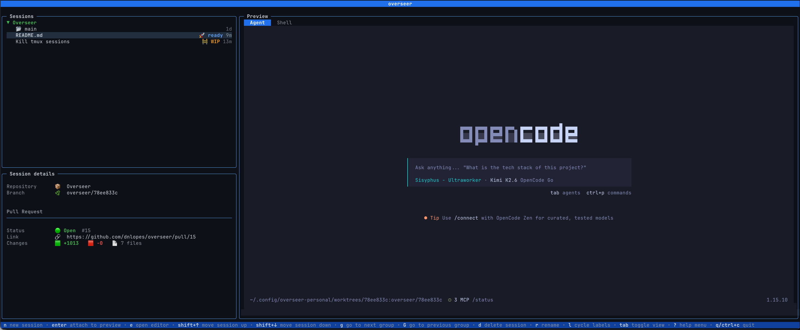
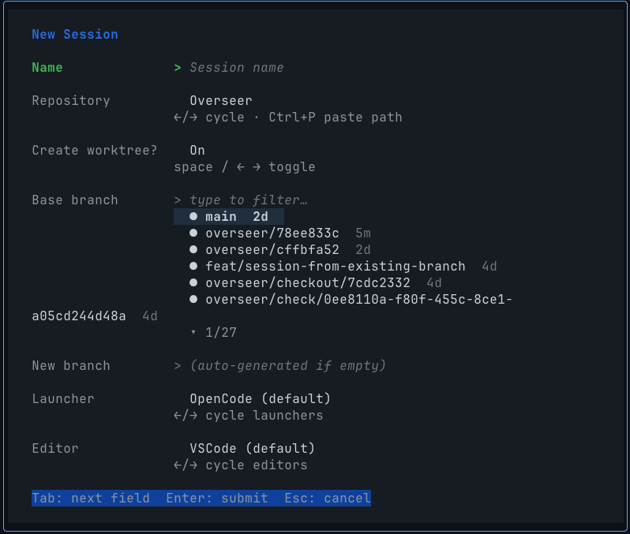
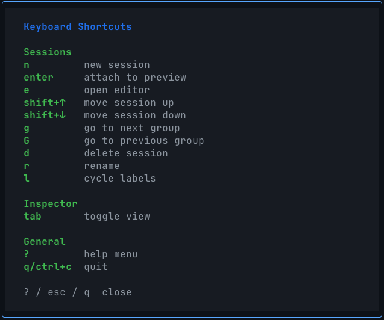

# Overseer

[](https://golang.org/)
[](https://opensource.org/licenses/MIT)
[](https://github.com/dnlopes/overseer/actions/workflows/build.yaml)

> A terminal-based dashboard for managing AI agent coding sessions with Git worktree isolation, tmux integration, and real-time session monitoring.

Overseer is a TUI application that helps developers organize, launch, and monitor AI agent sessions across multiple Git repositories. It provides isolated worktree-based sessions, project management, pull request tracking, and live session preview — all from your terminal.

---

## Table of Contents

- [Features](#features)
- [Screenshots](#screenshots)
- [Installation](#installation)
- [Quick Start](#quick-start)
- [Configuration](#configuration)
- [Usage](#usage)
- [Architecture](#architecture)
- [Contributing](#contributing)
- [License](#license)

---

## Features

### Session Management
- **Worktree Sessions**: Create isolated git worktrees on new branches for each AI agent session. Automatically forks from a base branch, sets up tmux sessions, and keeps your main working directory clean.
- **Project Sessions**: Attach sessions directly to a project's working directory without creating worktrees — perfect for quick experiments or when you don't need branch isolation.
- **Session Grouping**: Sessions are automatically grouped by project in a collapsible tree view.
- **Labels**: Color-coded labels to categorize and visually distinguish sessions.
- **Ordering**: Reorder sessions within projects to prioritize your work.

### Terminal Integration
- **Tmux Integration**: Automatically creates and manages tmux sessions for both the AI agent and a shell in the session's working directory.
- **One-Key Attach**: Attach to a session's tmux window directly from the dashboard.
- **Editor Launch**: Open a session's working directory in your configured editor (VSCode, Neovim, etc.).

### Real-Time Monitoring
- **Live Session Preview**: Toggle between Agent and Shell stream views to see what your AI agent is doing in real-time.

### Developer Experience
- **Keyboard-Driven**: Vim-inspired keybindings — navigate with `j`/`k`, create with `n`, delete with `d`, and more.
- **Customizable**: YAML configuration for themes, launchers, editors, labels, and dashboard dimensions.
- **Fast & Lightweight**: Built in Go with minimal resource usage.

---

## Screenshots

### Dashboard & Session Details

The main dashboard shows your projects and sessions in a three-pane layout. Select a session to see its details in the middle pane — repository info, branch, and linked pull request status with CI checks.



### Session Creation

Create a new session with a guided form. Choose between worktree mode (isolated branch) or project mode (direct working directory attachment).



### Help Menu

Press `?` at any time to see all available keyboard shortcuts.



---

## Installation

### Prerequisites

- **tmux** (for session management)
- **gh** (GitHub CLI — optional, for PR tracking)
- A configured **AI agent launcher** (e.g., [OpenCode](https://github.com/opencode-ai/opencode), [Claude Code](https://github.com/anthropics/anthropic-cookbook), or custom)

### Homebrew (Recommended)

```bash
brew tap dnlopes/overseer
brew install overseer
```

### Install to $GOPATH/bin

```bash
go install github.com/dnlopes/overseer/cmd/overseer@latest
```

### From Source

Requires **Go 1.24+**.

```bash
git clone https://github.com/dnlopes/overseer.git
cd overseer
make build
```

The binary will be available at `bin/overseer`.

---

## Quick Start

### 1. Launch Overseer

```bash
overseer
```

On first run, Overseer creates a default configuration file at:
- macOS: `~/Library/Application Support/overseer/overseer.yaml`
- Linux: `~/.config/overseer/overseer.yaml`

### 2. Register a Project

Press `n` to create a new session. If you haven't registered any projects yet, Overseer will prompt you to add a Git repository.

### 3. Create a Session

Fill out the session creation form:
- **Name**: A descriptive name for your session
- **Repository**: Choose from registered projects
- **Create worktree**: Enable for isolated branch-based sessions
- **Base branch**: The branch to fork from (e.g., `main`)
- **New branch**: The branch name for this session (auto-generated if empty)
- **Launcher**: The AI agent to use (e.g., OpenCode, Claude Code)
- **Editor**: Your preferred editor

### 4. Attach to Session

Select a session and press `Enter` to attach to its tmux window. Press `e` to open the session directory in your editor.

---

## Configuration

Overseer is configured via a YAML file. Here's the default configuration:

```yaml
# overseer.yaml
theme: dark
disableEmoji: false

dashboard:
  minWidth: 60
  minHeight: 15
  previewRefreshInterval: 500ms

logging:
  level: info

storage:
  dataDir: ""  # Uses OS default if empty

launchers:
  - displayName: "OpenCode"
    command: "opencode"
  - displayName: "Claude Code"
    command: "claude"

editors:
  - displayName: "VSCode"
    command: "code"
  - displayName: "Neovim"
    command: "nvim"

labels:
  - code: "urgent"
    color: "#ff6b6b"
    glyph: "!"
  - code: "wip"
    color: "#feca57"
    glyph: "⋯"
  - code: "review"
    color: "#54a0ff"
    glyph: "👁"
  - code: "done"
    color: "#1dd1a1"
    glyph: "✓"
```

### Configuration Options

| Section | Option | Description |
|---------|--------|-------------|
| `theme` | — | UI theme (`dark` or `light`) |
| `disableEmoji` | — | Set to `true` to disable emoji glyphs |
| `dashboard` | `minWidth` | Minimum terminal width required |
| `dashboard` | `minHeight` | Minimum terminal height required |
| `dashboard` | `previewRefreshInterval` | How often to refresh the preview pane |
| `logging` | `level` | Log level (`debug`, `info`, `warn`, `error`) |
| `storage` | `dataDir` | Directory for Overseer's data files |
| `launchers` | — | List of AI agent launchers |
| `editors` | — | List of code editors |
| `labels` | — | Custom labels for session categorization |

---

## Usage

### Keyboard Shortcuts

#### Sessions List

| Key | Action |
|-----|--------|
| `j` / `↓` | Move down |
| `k` / `↑` | Move up |
| `shift + ↓` | Reorder session down |
| `shift + ↑` | Reorder session up |
| `n` | Create new session |
| `d` | Delete selected session |
| `r` | Rename selected session |
| `l` | Cycle through labels |
| `Enter` | Attach to session (tmux) |
| `e` | Open session in editor |
| `g` / `G` | Go to next/previous project group |

#### Inspector (Preview Pane)

| Key | Action |
|-----|--------|
| `Tab` | Toggle between Agent and Shell views |

#### Global

| Key | Action |
|-----|--------|
| `?` | Show help menu |
| `q` / `Ctrl+C` | Quit |

### Session Modes

#### Worktree Session (Recommended)

Creates a fully isolated development environment:
- Forks a new branch from the base branch
- Creates a git worktree for the new branch
- Spawns tmux sessions (agent + shell) in the worktree directory
- Safe to run long-running or experimental agent tasks
- Easy cleanup: deleting the session removes the worktree

#### Project Session

Attaches directly to the project's working directory:
- No branch or worktree manipulation
- Uses the project's current HEAD
- Useful for quick experiments or when you don't need isolation

---

## Contributing

We welcome contributions! Please see [CONTRIBUTING.md](CONTRIBUTING.md) for guidelines on how to get started.

Quick links:
- [Bug Reports](https://github.com/dnlopes/overseer/issues/new?template=bug_report.md)
- [Feature Requests](https://github.com/dnlopes/overseer/issues/new?template=feature_request.md)
- [Pull Requests](https://github.com/dnlopes/overseer/pulls)

---

## License

[MIT](LICENSE) © David Lopes
