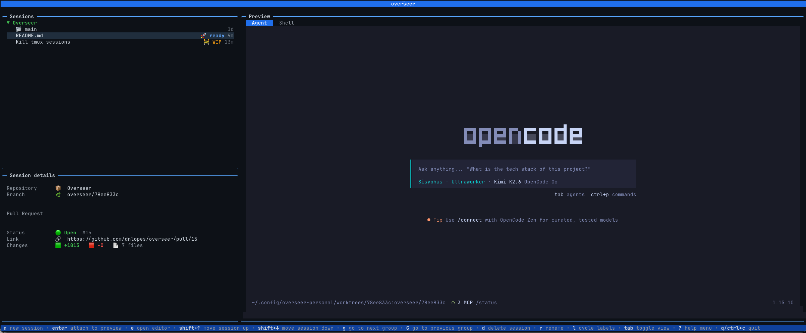
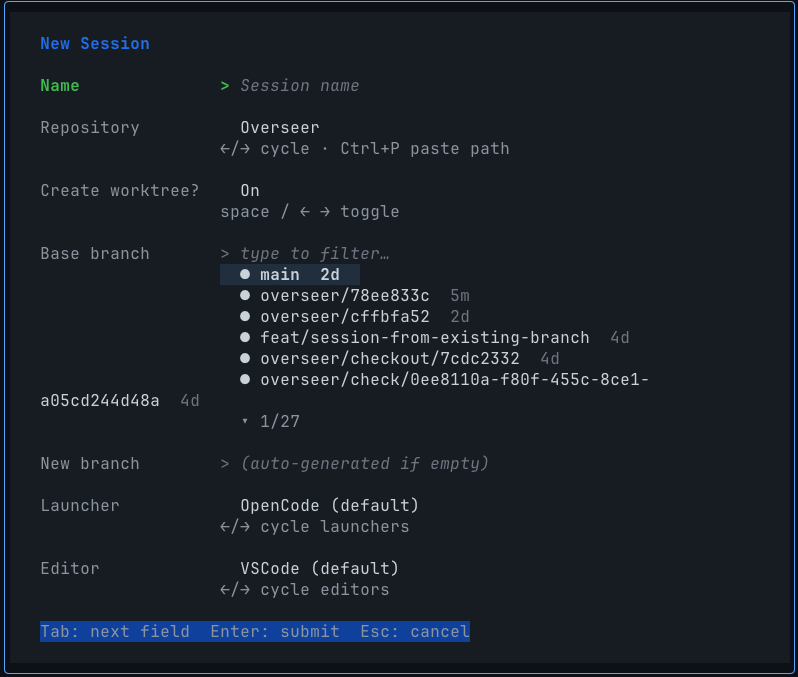
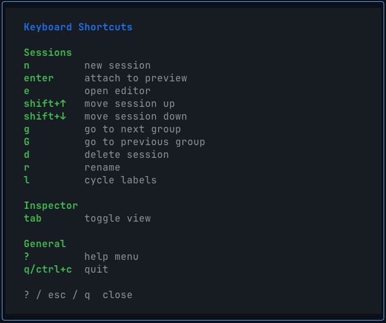

# Overseer

[](https://golang.org/)
[](https://opensource.org/licenses/MIT)
[](https://github.com/dnlopes/overseer/actions/workflows/build.yaml)

> A terminal-based dashboard for managing AI agent coding sessions with Git worktree isolation, tmux integration, and real-time session monitoring.

Overseer is a TUI application that helps developers organize, launch, and monitor AI agent sessions across multiple Git repositories. It provides isolated worktree-based sessions, project management, pull request tracking, and live session preview — all from your terminal.

---

## Table of Contents

- [Features](#features)
- [Screenshots](#screenshots)
- [Installation](#installation)
- [Quick Start](#quick-start)
- [Configuration](#configuration)
- [Usage](#usage)
- [Overseer Agent Loop](#overseer-agent-loop)
- [Swarm Mode](#swarm-mode)
- [Contributing](#contributing)
- [License](#license)

---

## Features

### Session Management
- **Worktree Sessions**: Create isolated git worktrees on new branches for each AI agent session. Automatically forks from a base branch, sets up tmux sessions, and keeps your main working directory clean.
- **Project Sessions**: Attach sessions directly to a project's working directory without creating worktrees — perfect for quick experiments or when you don't need branch isolation.
- **Session Grouping**: Sessions are automatically grouped by project in a collapsible tree view.
- **Labels**: Color-coded labels to categorize and visually distinguish sessions.
- **Ordering**: Reorder sessions within projects to prioritize your work.

### Terminal Integration
- **Tmux Integration**: Automatically creates and manages tmux sessions for both the AI agent and a shell in the session's working directory.
- **One-Key Attach**: Attach to a session's tmux window directly from the dashboard.
- **Editor Tab**: Press `e` to reveal an "Editor" tab that opens `nvim` in the session's working directory, right inside the dashboard's tmux-backed inspector.
- **Extended Key Support**: Overseer automatically enables tmux's `extended-keys` so modifier sequences like `Shift+Enter` are preserved inside the agent and shell sessions.

### Real-Time Monitoring
- **Live Session Preview**: Toggle between Agent and Shell stream views to see what your AI agent is doing in real-time.

### Swarm Mode
- **Multiple Agents, One Goal**: Run 2–8 agents in a single session, all working toward the same goal. Built for work a single agent context handles badly — research spanning several repositories, troubleshooting across many queries, broad audits.
- **Shared Message Board**: Agents coordinate through a per-session board they read and write over a loopback HTTP API. You watch it live in the **Agents Board** tab and can post to it yourself.
- **Automatic Wake-Ups**: Agent CLIs don't poll — they finish a turn and go idle. Overseer watches the board and nudges idle agents when there is something new to read, so the conversation keeps moving without you babysitting it.
- **Per-Agent Inspection**: The **Agent** tab pages through individual agent panes with `[` and `]`, so you can see what any one agent is actually doing when it stops making sense.
- **Bounded Chatter**: A configurable message cap and a debounced nudge window keep a swarm from talking itself into an expensive loop.

See [Swarm Mode](#swarm-mode) for the full picture.

### Overseer Chat Panel
- **Markdown Rendering**: Agent replies render as markdown — code blocks, lists and emphasis — with a rule between messages so a long exchange stays readable. The Agents Board renders the same way.
- **Agent Mode**: Chat with a Claude-backed meta-agent that can read session output and send prompts to your sessions on your behalf.
- **Operator Mode**: Type any message starting with `/` to execute a direct command without involving the LLM (see [Operator Commands](#operator-commands)).
- **Scrollable History**: The chat history is fully scrollable — use `↑`/`↓` to scroll line by line or `PgUp`/`PgDn` to jump a full page. New messages auto-scroll to the bottom unless you have scrolled up to read history.
- **Background Loops**: Start an evaluation loop that periodically checks a session's agent pane against your acceptance criteria and sends follow-up prompts until the goal is met.

### Project Discovery
- **Autodiscovery**: Configure one or more root directories and Overseer will scan their immediate subdirectories at startup, automatically registering any Git repositories it finds. A non-intrusive toast notification shows progress, and a warning popup highlights any configured paths that could not be found on disk.

### Developer Experience
- **Keyboard-Driven**: Vim-inspired keybindings — navigate with `j`/`k`, create with `n`, delete with `d`, and more.
- **Customizable**: YAML configuration for themes, launchers, editor, labels, and dashboard dimensions.
- **Fast & Lightweight**: Built in Go with minimal resource usage.

---

## Screenshots

### Dashboard & Session Details

The main dashboard shows your projects and sessions in a three-pane layout. Select a session to see its details in the middle pane — repository info, branch, and linked pull request status with CI checks.



### Session Creation

Create a new session with a guided form. Choose between worktree mode (isolated branch) or project mode (direct working directory attachment).



### Help Menu

Press `?` at any time to see all available keyboard shortcuts.



---

## Installation

### Prerequisites

- **tmux** (for session management)
- **gh** (GitHub CLI — optional, for PR tracking)
- A configured **AI agent launcher** (e.g., [Claude Code](https://docs.anthropic.com/en/docs/claude-code), [OpenCode](https://github.com/opencode-ai/opencode), or custom)

### Homebrew (Recommended)

```bash
brew tap dnlopes/overseer
brew install overseer
```

### Install to $GOPATH/bin

```bash
go install github.com/dnlopes/overseer/cmd/overseer@latest
```

### From Source

Requires **Go 1.24+**.

```bash
git clone https://github.com/dnlopes/overseer.git
cd overseer
make build
```

The binary will be available at `bin/overseer`.

---

## Quick Start

### 1. Launch Overseer

```bash
overseer
```

On first run, Overseer creates a default configuration file at:
- macOS: `~/Library/Application Support/overseer/config.yaml`
- Linux: `~/.config/overseer/config.yaml`

### 2. Register a Project

Press `n` to create a new session. If you haven't registered any projects yet, Overseer will prompt you to add a Git repository path.

Alternatively, configure `projectDiscovery` paths (see [Configuration](#configuration)) and Overseer will auto-register repos from those directories at startup — no manual registration needed.

### 3. Create a Session

Fill out the session creation form (navigate fields with `Tab` / `Shift+Tab` or `↑` / `↓`):

| Field | Default | Notes |
|-------|---------|-------|
| **Name** | — | Descriptive name for the session |
| **Repository** | — | Choose from registered projects |
| **Create worktree** | Off | Enable for isolated branch-based sessions |
| **Base branch** | — | Branch to fork from (e.g., `main`); shown when worktree is on |
| **New branch** | — | Branch name for this session; auto-generated if left empty |
| **Swarm?** | Off | Run several agents on one goal; shown when swarm mode is enabled in config |
| **Agents** | 2 | How many agents to run; shown when Swarm is on |
| **Goal** | — | What the swarm should achieve; required when Swarm is on |
| **Launcher** | Claude Code | AI agent to run in the session |

The editor is not chosen per session — it comes from the `editorCommand` config value (default `nvim`).

### 4. Attach to Session

Select a session and press `Enter` to attach to its tmux window. Press `Tab` to cycle the inspector tabs. Press `e` to reveal the Editor tab and drop straight into `nvim` at the session directory; the tab persists so you can detach and re-attach with `Enter`.

Which tabs you get depends on the session:

| Session type | Tabs |
|--------------|------|
| Ordinary | `Agent` · `Shell` · `Editor` (after `e`) |
| Swarm | `Agents Board` · `Agent N/M` · `Shell` · `Editor` (after `e`) |

---

## Configuration

Overseer is configured via a YAML file. Here's a full example:

```yaml
# config.yaml
theme: dark
disableEmoji: false

dashboard:
  minWidth: 60
  minHeight: 15
  previewRefreshInterval: 500ms

logging:
  level: info

storage:
  dataDir: ""  # Uses OS default if empty

# Scan these directories at startup and auto-register any Git repos found.
# Only immediate subdirectories are inspected (no recursive walk).
# ~ is expanded to your home directory.
projectDiscovery:
  paths:
    - ~/code
    - ~/projects

launchers:
  - displayName: "Claude Code"
    command: "claude"
    agentType: "claude-code"
  - displayName: "OpenCode"
    command: "opencode"
    agentType: "opencode"

editorCommand: "nvim"

# Multi-agent swarm sessions. When enabled, Overseer starts a loopback HTTP
# board that the agent processes use to talk to each other.
swarm:
  enabled: true
  maxAgents: 8              # ceiling offered in the create form (domain max is 8)
  nudgeDebounce: 2s         # how often pending board activity is flushed to agents
  maxMessagesPerSession: 500 # circuit breaker; 0 disables the cap
  boardAddr: "127.0.0.1:0"  # :0 picks a free port. Keep this on loopback.

labels:
  - code: "urgent"
    color: "#ff6b6b"
    glyph: "!"
  - code: "wip"
    color: "#feca57"
    glyph: "⋯"
  - code: "review"
    color: "#54a0ff"
    glyph: "👁"
  - code: "done"
    color: "#1dd1a1"
    glyph: "✓"
```

### Configuration Options

| Section | Option | Description |
|---------|--------|-------------|
| `theme` | — | UI theme (`dark` or `light`) |
| `disableEmoji` | — | Set to `true` to disable emoji glyphs |
| `dashboard` | `minWidth` | Minimum terminal width required |
| `dashboard` | `minHeight` | Minimum terminal height required |
| `dashboard` | `previewRefreshInterval` | How often to refresh the preview pane |
| `logging` | `level` | Log level (`debug`, `info`, `warn`, `error`) |
| `storage` | `dataDir` | Directory for Overseer's data files (must be absolute) |
| `projectDiscovery` | `paths` | List of directories to scan at startup for Git repos |
| `launchers` | — | List of AI agent launchers (`displayName`, `command`, `agentType`) |
| `editorCommand` | — | Editor command run in the Editor tab (default `nvim`) |
| `swarm` | `enabled` | Turn swarm mode on/off. When off, the board server never starts and the create form hides the swarm fields |
| `swarm` | `maxAgents` | Highest agent count the create form offers (2–8) |
| `swarm` | `nudgeDebounce` | Interval at which idle agents are woken. Longer coalesces more chatter into one round |
| `swarm` | `maxMessagesPerSession` | Board message cap; further posts are rejected with `429`. `0` disables the cap |
| `swarm` | `boardAddr` | Address the board HTTP server binds. Loopback only — the board has no authentication |
| `labels` | — | Custom labels for session categorization |

#### Project Discovery

When `projectDiscovery.paths` is set, Overseer scans each listed directory at startup:

- Only **immediate subdirectories** are inspected (one level deep, no recursion).
- Directories that are not valid Git repositories are silently skipped.
- Already-registered repos are skipped without duplication.
- A **toast notification** appears in the top-right corner of the dashboard while scanning, and briefly shows how many new repos were found.
- If any configured path **does not exist on disk**, a warning popup is shown at startup listing the missing paths. Press `Enter` or `Esc` to dismiss it.

---

## Usage

### Keyboard Shortcuts

#### Sessions List

| Key | Action |
|-----|--------|
| `j` / `↓` | Move down |
| `k` / `↑` | Move up |
| `Shift+↓` | Reorder session down |
| `Shift+↑` | Reorder session up |
| `n` | Create new session |
| `d` | Delete selected session (`p` in the dialog also purges a swarm's board) |
| `r` | Rename selected session |
| `l` | Cycle through labels |
| `Enter` | Attach to session (agent or shell, based on active inspector tab) |
| `e` | Reveal Editor tab and open nvim at the session directory |
| `Ctrl+E` | Submit the agent's queued prompt (see below) |
| `x` | Kill the preview tmux session |
| `g` / `G` | Go to next / previous project group |

#### Session Creation Form

| Key | Action |
|-----|--------|
| `Tab` / `Shift+Tab` | Next / previous field |
| `↓` / `↑` | Next / previous field |
| `←` / `→` | Cycle option (launcher, agent count, toggles) |
| `Space` | Toggle worktree or swarm on/off |
| `e` | Paste a path into the repository field |
| `Enter` | Create session |
| `Esc` | Cancel |

#### Inspector (Preview Pane)

| Key | Action |
|-----|--------|
| `Tab` | Cycle the visible tabs |
| `x` | Kill the tmux pane behind the active tab (no-op on the Agents Board) |
| `[` / `]` | Previous / next agent pane (swarm sessions, Agent tab) |
| `i` | Compose a message to the swarm (swarm sessions, Agents Board tab) |

While composing a board message, every key goes to the input — including `q`. Press `Esc` to cancel or `Enter` to post; `Ctrl+C` still quits.

**`Ctrl+E` follows the active tab.** On a swarm's `Agent N/M` tab it submits that one pane's queued prompt; anywhere else on a swarm — including the Agents Board, which stands for the whole swarm — it submits **all** of them. On an ordinary session it always targets its single agent. `/enter <session>` does the same broadcast from the chat, whichever session is selected.

An Enter is safe to send repeatedly: it submits a pending prompt and is a harmless newline otherwise.

#### Overseer Chat Panel

Open / close the chat panel with `Ctrl+O` from anywhere in the dashboard.

**Input modes** — auto-detected per message:

| Prefix | Mode | Behaviour |
|--------|------|-----------|
| _(none)_ | Agent | Message sent to the Claude meta-agent (LLM) |
| `/` | Operator | Parsed as a slash command; no LLM call |

**Operator commands:**

| Command | Description |
|---------|-------------|
| `/send <session> <prompt…>` | Send a prompt directly to a session's agent pane |
| `/enter <session>` | Submit whatever is queued in **all** of a session's agent prompts |
| `/delete <session>` | Open the delete-session confirmation dialog |
| `/new` | Open the new-session creation form |
| `/list` | Print all active sessions inline |
| `/loop <session> <criteria…>` | Start a background evaluation loop |
| `/loop stop <session>` | Stop a running loop |
| `/loop info <session>` | Print loop status, iteration count, and criteria |
| `/help` | List all available commands |

**Scrolling the chat history:**

| Key | Action |
|-----|--------|
| `↑` | Scroll history up one line |
| `↓` | Scroll history down one line |
| `PgUp` | Scroll history up one page |
| `PgDn` | Scroll history down one page |

New messages auto-scroll to the bottom only if you were already at the bottom. Scrolling up to read history freezes the view until you scroll back down.

**While the chat panel is open**, `↑`/`↓` scroll the chat history. To navigate the session list at the same time, use `j`/`k` instead.

#### Global

| Key | Action |
|-----|--------|
| `Ctrl+O` | Toggle Overseer chat panel |
| `?` | Show help menu |
| `q` / `Ctrl+C` | Quit |

`q` only quits when nothing is capturing the keyboard. While the chat panel or a board message is open, `q` is a character you are typing — use `Ctrl+C` to quit from there.

### Session Modes

#### Worktree Session

Creates a fully isolated development environment:
- Forks a new branch from the base branch
- Creates a git worktree for the new branch
- Spawns tmux sessions (agent + shell) in the worktree directory
- Safe to run long-running or experimental agent tasks
- Easy cleanup: deleting the session removes the worktree

#### Project Session (default)

Attaches directly to the project's working directory:
- No branch or worktree manipulation
- Uses the project's current HEAD
- Useful for quick experiments or when you don't need isolation

---

## Overseer Agent Loop

The `/loop` command starts a background evaluation loop that runs `claude -p` directly in the session's working directory until the task is complete — or a safety limit is hit.

### Starting a loop

```
/loop overseer-improvements all failing tests are now passing
```

Overseer will:
1. Run `claude -p --dangerously-skip-permissions` in the session's working directory with your criteria as the task.
2. Automatically append the sentinel instruction: "When you have finished this task, write the word END on its own line as your final message."
3. If **`END` is found in the output**: the loop stops and marks the task done.
4. If **not done**: wait 5 seconds, then run again.
5. Repeat up to **40 iterations** (safety cap). Stops early after 3 consecutive errors.

### Loop status

- The session row in the list shows a badge: 🔄 running · ✅ done · ⏹ stopped.
- The **Session Details** pane shows a Loop section with status, iteration count, elapsed time, and criteria.
- The chat panel prints a dimmed system message after each iteration and a final summary when the loop ends.

### Stopping a loop manually

```
/loop stop overseer-improvements
```

### Checking loop status

```
/loop info overseer-improvements
```

---

## Swarm Mode

A swarm session runs 2–8 agents against one goal, coordinating through a shared message board.

It exists for work that a single agent context handles badly: research spanning several repositories, troubleshooting that needs many separate queries, broad audits. For a focused task on one codebase, one agent is still the right answer.

### Creating a swarm

Press `n`, turn **Swarm?** on, pick an agent count, and write a goal. On create, Overseer:

1. Spawns one tmux pane per agent (`<session-uuid>-agent-1` … `-agent-N`)
2. Writes a bootstrap descriptor the agents read
3. Posts your goal as the board's first message
4. Introduces each agent to its own identity and the board protocol

### The Agents Board

The **Agents Board** tab is a live transcript, with each agent given its own colour. Press `i` to write a message to the whole swarm, `Enter` to post, `Esc` to cancel. Use `PgUp` / `PgDn` to scroll back — new posts won't yank you to the bottom while you're reading history.

Each post leads with its **message number**:

```
#7    10:43:43 agent-3
The precedent claim is FALSE. No cross-revision addressing exists here.
────────────────────────────────────────────────────────────────────────
#25   10:53:20 agent-1
Resolving @agent-2 #21 vs @agent-3 #24 — you are both right about
different halves.
```

Agents cite each other by that number constantly — 86% of posts did in one review run — so without it on screen you cannot follow a reference. The posting conventions tell them to use the same `#12` notation the board displays.

Message bodies render as markdown, with a rule between posts. Paste works in the compose line and in the Overseer chat.

### How the agents are told to work

Alongside the goal, the bootstrap descriptor ships a short **method** the agents follow. Each rule
comes from something measured on a real run rather than general prompt advice:

- **Try to break your own claim before posting it, and say what survived.** Across two runs, the one
  where agents did this 11 times had 5 reversals; the one where they never did had 10. Pre-testing a
  claim roughly halves the correction churn.
- **Claim an axis nobody else holds; earliest claim wins.** Agents had been duplicating work and once
  had to invent a tie-break rule on the spot when three claimed the same write.
- **State your confidence and what would change your mind.** *"I can't tell from the evidence, and
  here's why each candidate fails"* was the single most decision-relevant thing either run produced.
- **Prefer closing an open finding to opening another.** One run had to be told, two thirds of the
  way in, to stop auditing and start converging.
- **Post a verdict when the goal is answered, without being asked.** Neither run did this
  spontaneously.

Tune them in `boardMethod` (`internal/adapters/secondary/swarmboard/board.go`). Its sibling
`boardConventions` governs how posts are *written*; keep the two separate.

### Keeping posts readable

Left to their own devices, agents write multi-kilobyte essays — a five-agent run averaged about 3KB per post, which makes the board unreadable exactly when it matters. The bootstrap descriptor therefore ships **posting conventions**: lead with one bold claim line, stay under roughly twelve lines, prefer numbers and paths over sentences explaining them, and cite a `seq` rather than restating the board.

These target *prose, not evidence*. The tables and held-out numbers inside long posts are what catch a bad premise; compressing those away would trade the feature's main benefit for a shorter scroll.

If your agents are still too chatty (or too terse), the rules are a plain list in `boardConventions` — `internal/adapters/secondary/swarmboard/board.go`. Note that `maxMessagesPerSession` caps the *number* of posts, not their length; there is no length cap you should tune, because a rejected post is work already paid for.

### How agents stay in sync

This is the part worth understanding. **Agent CLIs don't loop** — they finish a turn and sit idle at their prompt. A message board alone would be a mailbox with no doorbell: agent 3 would never learn what agent 2 just wrote.

So Overseer is the doorbell. It watches the board and, on a `nudgeDebounce` tick, types a short "read the board" instruction into every idle agent's pane — skipping whoever posted last, since they just spoke. A burst of posts inside one tick costs a single round of wake-ups, which is what stops a swarm nudging itself into an endless conversation.

Two more guards on that: the board rejects posts past `maxMessagesPerSession` with `429`, and the agents are told up front to post only when they have something substantive.

### Working directory

All agents in a swarm share the session's one working directory. That suits read-heavy work; for anything that writes, the agents are instructed to claim a file on the board before editing it. Coordination is advisory, not enforced — if two agents ignore each other, they can still collide.

### The board API

The board is a loopback HTTP server on an ephemeral port, started when `swarm.enabled` is true. Agents get the exact calls in their descriptor, so you rarely need this — but it's useful for debugging:

| Method | Path | Purpose |
|--------|------|---------|
| `POST` | `/v1/sessions/{id}/messages` | Post a message: `{"author":"agent-2","content":"…"}` |
| `GET` | `/v1/sessions/{id}/messages?since=N` | Read messages after cursor `N` |
| `GET` | `/healthz` | Liveness |

Responses: `201` on post, `400` malformed, `404` unknown or non-swarm session, `429` cap reached.

> **The board has no authentication.** Any local process can post to it. Keep `boardAddr` on loopback and don't expose the port.

### Where swarm data lives

Under Overseer's data directory, never inside your repository:

```
<dataDir>/swarm/<session-short-id>/
├── messages.jsonl   # append-only board log, one JSON record per line
└── swarm.json       # bootstrap descriptor the agents read
```

Board history survives an Overseer restart, **and it survives deleting the session** — the
transcript is the record of how the swarm reasoned, which usually outlives the session row it
belonged to.

To delete the transcript as well, press `p` in the delete confirmation to arm **board purge**. The
popup states which way it is set before you confirm, because the purge cannot be undone. The option
only appears for swarm sessions.

That does mean board directories accumulate under `<dataDir>/swarm/`. They are small JSONL files,
but nothing prunes them for you — `rm -rf` the ones you no longer want.

### Starting up

A newly created agent pane exists within milliseconds, but the agent CLI behind it takes seconds to accept input. So Overseer types each agent's briefing and then submits it from the background flush job, retrying a few rounds — sending the Enter immediately would leave every agent holding a prompt it never sent.

In practice a new swarm starts working a few seconds after creation. If a cold start is slow enough to outlast the retries, press `Ctrl+E` on the Agents Board (or run `/enter <session>`) to submit the queued briefings yourself.

### Current limitations

- **Agent status is not tracked per agent.** A swarm shows a 🐝 marker rather than a running/waiting/idle state: the status API carries one status per session and a swarm has N panes. Aggregating them needs a rule (any agent waiting → waiting?) that per-pane detection would have to come first.
- **Startup submission is retried, not detected.** Overseer does not model each CLI's readiness — it re-sends Enter for a bounded number of rounds. `Ctrl+E` / `/enter` is the manual backstop.
- **No re-bootstrap after restart.** The panes and board survive, but nothing re-briefs the agents. Post to the board to get them moving again.
- **`nudgeDebounce` needs tuning.** The `2s` default is a starting point, not a tested optimum — raise it if your swarm is too chatty.
- **Cost scales with agent count.** N agents on one goal means roughly N times the tokens. The message counter in the board footer is there to keep that visible.

---

## Contributing

We welcome contributions! Please see [CONTRIBUTING.md](CONTRIBUTING.md) for guidelines on how to get started.

Quick links:
- [Bug Reports](https://github.com/dnlopes/overseer/issues/new?template=bug_report.md)
- [Feature Requests](https://github.com/dnlopes/overseer/issues/new?template=feature_request.md)
- [Pull Requests](https://github.com/dnlopes/overseer/pulls)

---

## License

[MIT](LICENSE) © David Lopes
